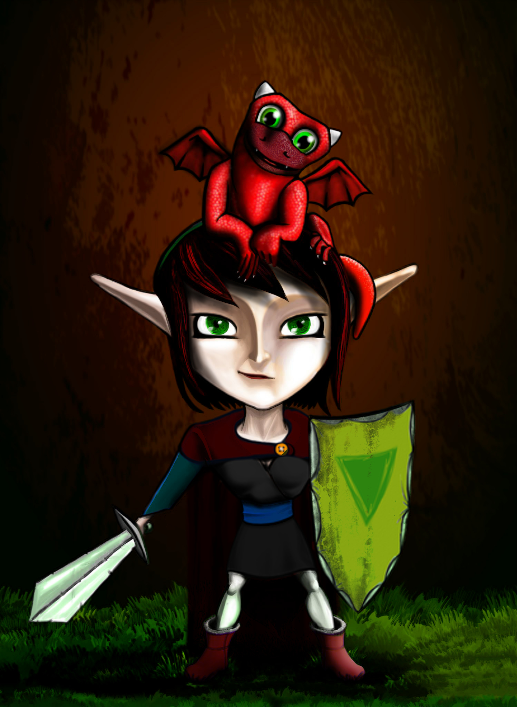

## Shroud of the Forsaken

Shroud of the Forsaken is a 2.5D hack-n-slash RPG written from the ground up in C. It was made by a team of four coders over a period of four months. It was my first game project as an undergrad at DigiPen. I ported the game to javascript for the purposes of education and promotion.

### [Play](https://solarbro.github.io/Shroud/play/)

### Tutorials
[1. Getting Started](https://solarbro.github.io/Shroud/1_Getting_Started/)

[2. Game State Manager](https://solarbro.github.io/Shroud/2_Game_State_Manager/)

[3. User Input](https://solarbro.github.io/Shroud/3_User_Input/)

